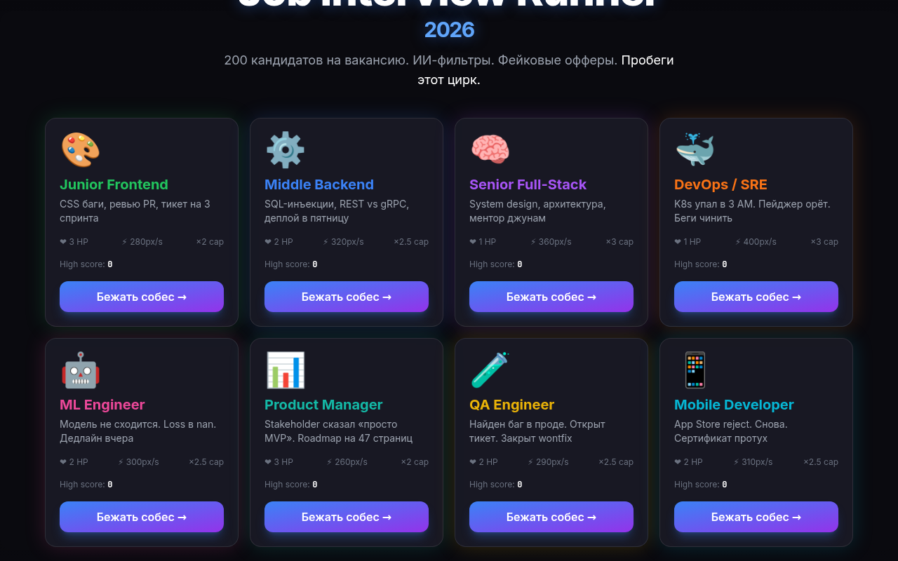
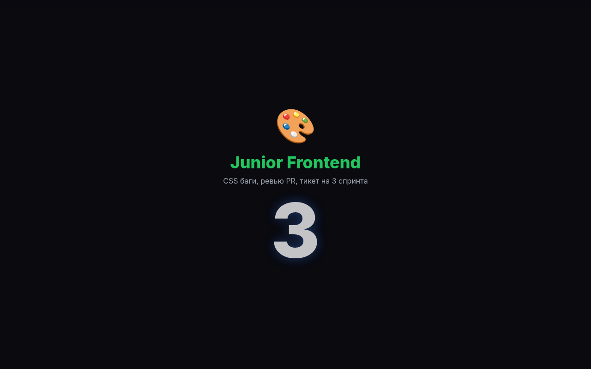
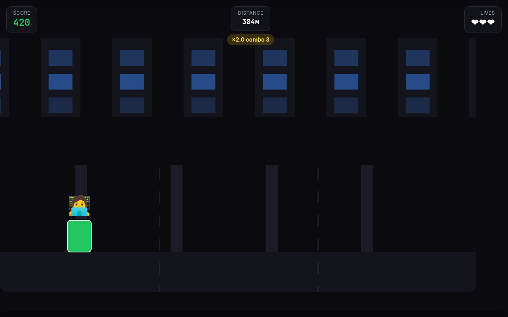
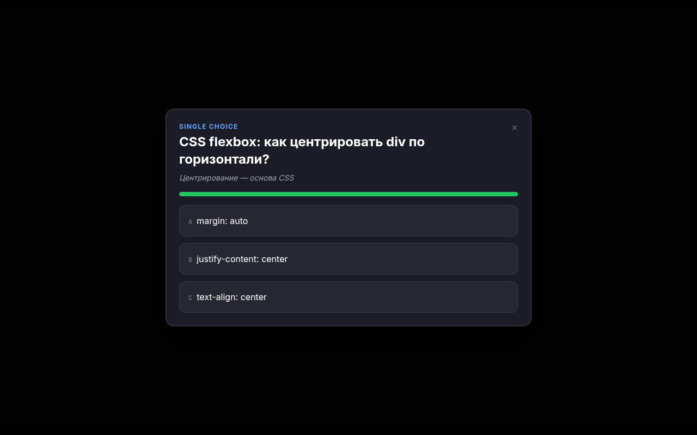
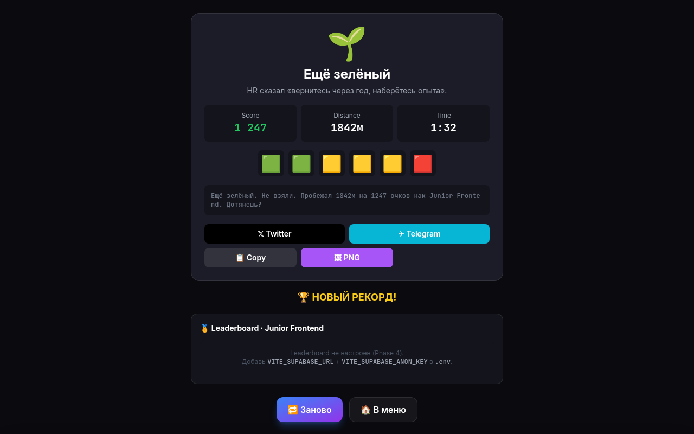

# Job Interview Runner — 2026

> Endless runner × QTE about IT job interviews in 2026. Indie browser game.

A fast, shareable web game about the most painful part of modern hiring: 200 candidates per role, AI filters, fake offers. Sprint through a corporate hallway, dodge red flags, ship commits, and ace quick-time events in 8 different IT roles. Share your score on Twitter with a Wordle-style emoji grid.

**Target: 100K DAU in 90 days via viral sharing.**



## Screenshots

| Menu | Briefing | Gameplay | QTE | End screen |
|:---:|:---:|:---:|:---:|:---:|
|  |  |  |  |  |

## Features

- **40+ QTE scenarios** based on real IT interview problems (SQL injection, race conditions, system design, k8s manifests, RICE prioritization)
- **8 roles** with unique gameplay stats (Junior Frontend → Mobile Developer)
- **Roguelike modifiers** — each run picks 2 random modifiers (overtime_expected, toxic_pm, layoff_season, remote_revoked, demo_day, etc.) that change spawn rate, speed, lives, multiplier
- **5 QTE mechanics**: single-choice, spot-bug, sequence, slider, hold — each with perfect / ok / fail scoring
- **Wordle-style share card** (1200×630 PNG) with 6-emoji grid and pre-filled tweet
- **Supabase leaderboard** with server-side HMAC-SHA256 anti-cheat
- **PWA-ready** — installable to home screen, offline cache via service worker
- **Mobile-optimized** landing page for cross-platform sharing
- **Difficulty slider** — easy/normal/hard affects spawn rate, QTE timeout, lives, score multiplier
- **Tutorial overlay** for first-run onboarding

## Tech Stack

| Layer | Choice | Why |
|---|---|---|
| Bundler | **Vite 5** | Fast dev, instant HMR, Rollup production |
| Language | **TypeScript** (strict) | Type-safety, better DX |
| Framework | **React 18** | UI overlays, QTE modals, share card |
| Renderer | **PixiJS v8** + @pixi/react | WebGL/Canvas for 2D runner |
| State | **Zustand** | Minimal store, TS-first, shared between Canvas + HTML |
| UI kit | **Tailwind CSS** + shadcn-style | Modern standard |
| Animations | **Framer Motion** | UI animations, modals, transitions |
| Persistence | LocalStorage + Supabase | Progressive |
| Backend | **Supabase** | Free tier, REST + Realtime + Edge Functions |
| CI/CD | **Vercel** + **GitHub Actions** | Auto-deploy, preview URLs, edge CDN |
| Analytics | **Plausible** | GDPR-friendly, no cookies |
| Errors | **Sentry** (optional) | 5K events/mo free |
| Share card | **html-to-image** | PNG 1200×630 client-side |
| Audio | **Web Audio API** | Synthesis, no files, < 50KB |

## Architecture

```
src/
├── main.tsx              # React root + window.__GAME_STORE__ (E2E)
├── App.tsx               # ErrorBoundary + GameCanvas + GameUI
├── scenes/               # PixiJS Canvas
│   ├── BootScene.ts      # loading + random tip
│   ├── RunScene.ts       # endless runner core (3 lanes, parallax, spawner, QTE trigger)
│   ├── PixiApp.ts        # Pixi Application lifecycle
│   └── world.ts          # world constants
├── ui/                   # React HTML overlay
│   ├── GameCanvas.tsx    # Pixi host + graceful no-WebGL fallback
│   ├── GameUI.tsx        # keyboard, scene-routing overlay
│   ├── Menu.tsx          # role select (8 roles)
│   ├── Briefing.tsx      # 3-2-1 countdown
│   ├── HUD.tsx           # score / lives / combo meter
│   ├── QTEOverlay.tsx    # 5 QTE mechanics
│   ├── EndScene.tsx      # share card + leaderboard + restart
│   ├── ShareCard.tsx     # PNG share card via html-to-image
│   ├── Leaderboard.tsx   # top-10 daily / all-time per role
│   └── ModifiersScreen.tsx  # pre-run "News Flash"
├── systems/
│   ├── store.ts          # Zustand store (game state)
│   ├── spawner.ts        # obstacle / pickup pools
│   ├── collision.ts      # AABB detection
│   ├── audioBus.ts       # Web Audio synthesis
│   ├── antiCheat.ts      # client-side HMAC stub
│   ├── telemetry.ts      # Plausible + A/B test
│   └── storage.ts        # LocalStorage
├── data/
│   ├── roles.ts          # 8 roles with stats
│   ├── qtes.ts           # 40 QTE × 8 roles
│   ├── modifiers.ts      # 8 roguelike modifiers
│   ├── endings.ts        # 64 endings (8 × 8)
│   ├── obstacles.ts      # 5 obstacle types
│   └── pickups.ts        # 5 pickup types
└── lib/
    ├── supabase.ts       # Leaderboard client
    └── utils.ts          # cn() helper

supabase/
├── migrations/0001_init.sql       # runs, runs_anon, leaderboard_daily
└── edge-functions/verify-run/     # HMAC verify + rate limit

tests/                              # Vitest unit tests (38 tests)
├── qtes.test.ts                    # 5 QTE mechanics × perfect/ok/fail
├── scoring.test.ts                 # tier logic, combo math, emoji grid
├── antiCheat.test.ts               # djb2 hash, payload validation
├── modifiers.test.ts               # roguelike modifiers
├── spawner.test.ts                 # spawn cadence, lane selection
├── collision.test.ts               # AABB hitbox
└── audio.test.ts                   # Web Audio synthesis (mocked)
```

**Layer separation:**
- **PixiJS Canvas** = game world (player, obstacles, particles, parallax)
- **React HTML overlay** = menus, QTE, HUD, share card
- **Zustand** = shared state between Canvas and HTML

## Quick Start

### Prerequisites
- Node.js 20+
- npm 10+

### Install & run

```bash
git clone https://github.com/techbuzzz/Rec2IT.git
cd Rec2IT
npm install
npm run dev
```

Open [http://localhost:5173](http://localhost:5173).

### Build for production

```bash
npm run build      # TypeScript check + Vite build → dist/
npm run preview    # serve dist/ locally
```

### Other commands

```bash
npm test                # run unit tests (38 tests)
npm run test:coverage   # with coverage report
npm run typecheck       # tsc --noEmit
npm run lint            # ESLint
npm run smoke           # smoke test (boot → menu → run → end)
npm run perf:check      # bundle size audit
npm run bundle:stats    # bundle stats markdown table
```

## Deployment

### Vercel (recommended)

1. Fork / clone this repo
2. Import project in [Vercel dashboard](https://vercel.com/new)
3. Set environment variables:
   - `VITE_SUPABASE_URL` — your Supabase project URL
   - `VITE_SUPABASE_ANON_KEY` — Supabase anon key
   - `VITE_ANTI_CHEAT_SECRET` — generate via `openssl rand -hex 32`
4. Deploy — Vercel auto-builds on every push to `main`

### Supabase

1. Create project at [supabase.com](https://supabase.com)
2. Apply migration: paste `supabase/migrations/0001_init.sql` in SQL editor
3. Deploy Edge Function:
   ```bash
   supabase functions deploy verify-run
   supabase secrets set ANTI_CHEAT_SECRET=<same-as-vercel-env>
   ```

### Plausible (analytics)

1. Sign up at [plausible.io](https://plausible.io)
2. Add domain (`rec2it.run`)
3. The script is auto-included; no env vars needed

## Game Design

### Roles (8)

| Role | Base Speed | Lives | Difficulty | Vibe |
|---|---|---|---|---|
| **Junior Frontend** | 280 | 3 | Easy | CSS bugs, code review, 3-sprint tickets |
| **Middle Backend** | 320 | 3 | Medium | SQL injection, scaling, on-call |
| **Senior Fullstack** | 380 | 3 | Hard | System design, mentoring, layoffs |
| **DevOps** | 340 | 3 | Medium | k8s manifests, CI/CD, on-call rotation |
| **ML Engineer** | 300 | 3 | Hard | TensorFlow, GPU costs, model drift |
| **Product Manager** | 360 | 3 | Medium | RICE prioritization, stakeholder mgmt |
| **QA Engineer** | 290 | 4 | Easy | Bug reports, regression testing |
| **Mobile Developer** | 330 | 3 | Medium | App Store reviews, fragmentation |

### Scoring

- **Distance**: 1 point per meter
- **QTE perfect**: 50 points (in first 30% of time)
- **QTE ok**: 20 points (completed, late)
- **Pickup**: 10 points (commits, coffee, mentorship)
- **Combo multiplier**: ×1.5 / ×2.0 / ×3.0 (based on streak)
- **Modifier multiplier**: ×0.8 / ×1.0 / ×1.5 (difficulty)

### Anti-cheat

- Client: HMAC-SHA256 hash of `run_id + score + role + SECRET`
- Server: Edge Function verifies hash + score-cap + speed-ratio (1-50 m/s) + rate-limit (1 run / 5s / IP)
- RLS policies: anon read-only, service_role write-only

## Performance

| Metric | Value |
|---|---|
| **Initial bundle (landing)** | **4 KB gz** |
| **Initial bundle (game menu)** | **57 KB gz** |
| **Pixi chunk** | 1.1 MB raw / 336 KB gz (lazy-loaded) |
| **Supabase chunk** | 120 KB raw / 34 KB gz (lazy-loaded) |
| **Total assets** | 1.55 MB (with WebP screenshots) |
| **Lighthouse score** (target) | 95+ |

See [bundle-stats output](docs/bundle-stats.md) for current numbers.

## Testing

38 unit tests covering:
- 5 QTE types × 8 roles × perfect/ok/fail/timeout outcomes
- Scoring math (distance, combo, multiplier)
- Anti-cheat hash + payload validation (10 edge cases)
- Modifier application (buff/debuff balance)
- Spawner cadence + lane selection
- Collision AABB detection
- Web Audio synthesis (mocked AudioContext)

Run with:
```bash
npm test
npm run test:coverage
```

## Documentation

- **[TZ.md](TZ.md)** — original technical specification (Russian, internal)
- **[CHANGELOG.md](CHANGELOG.md)** — version history (English)
- **[PRESS_KIT.md](PRESS_KIT.md)** — press materials and contact
- **[SOFT_LAUNCH.md](SOFT_LAUNCH.md)** — Phase 7 launch checklist
- **[SECURITY.md](.github/SECURITY.md)** — security policy + disclosure
- **[CODE_OF_CONDUCT.md](.github/CODE_OF_CONDUCT.md)** — Contributor Covenant 2.1

## Project Status

| Phase | Status | Description |
|---|---|---|
| 0. Discovery | ✅ | Concept, roles, scoring, TZ.md |
| 1. Prototype | ✅ | Vite + React + TS + Pixi vertical slice |
| 2. QTE System | ✅ | 40 QTE templates, 5 mechanics |
| 3. Share Card | ✅ | PNG 1200×630 + UTM tracking + A/B test |
| 4. Leaderboard | ✅ | Supabase + Edge Function + anti-cheat |
| 5. Content | ✅ | 8 roles + 8 modifiers + 64 endings |
| 6. Virality | ✅ | Plausible + A/B + landing page |
| 7. Soft Launch | ✅ | Press kit + Product Hunt draft |
| 8. Iterate | ✅ | Seasons + per-run meme finals |
| 9. Optimization | ✅ | Tests + PWA + WebP + Settings |
| 10. Growth | ✅ | Mobile landing + difficulty + tutorial |

**Current version: v0.9.0** — production-ready, awaiting soft launch.

## Contributing

Contributions welcome! Please:
1. Open an issue first to discuss major changes
2. Follow the PR template (`/.github/PULL_REQUEST_TEMPLATE.md`)
3. Run `npm run lint && npm test && npm run build` before submitting
4. Match existing code style (TypeScript strict, no `any`)

See [CONTRIBUTING.md](.github/CONTRIBUTING.md) (coming soon) for details.

## License

Source-available, non-commercial. See [LICENSE](LICENSE) for terms.

For commercial use / partnership inquiries: hello@rec2it.app

## Author

**Victor** — Tech Lead, 15+ years in enterprise .NET, led 16–32 engineers. Built this to process his own interview fatigue.

- Twitter: [@rec2it_run](https://twitter.com/rec2it_run)
- GitHub: [@techbuzzz](https://github.com/techbuzzz)
- Email: hello@rec2it.app

## Acknowledgments

- [PixiJS](https://pixijs.com/) — fast 2D WebGL renderer
- [Supabase](https://supabase.com) — Postgres + Edge Functions in minutes
- [Vite](https://vitejs.dev) — instant HMR
- [Tailwind CSS](https://tailwindcss.com) — utility-first CSS
- [Wordle](https://www.nytimes.com/games/wordle) — share card inspiration
- The IT community on Habr, Reddit, Telegram — for endless material

---

**⭐ Star this repo** if it made you laugh. **🐦 Tweet your score** at [@rec2it_run](https://twitter.com/rec2it_run).

Try it → **[rec2it.run](https://rec2it.run)**