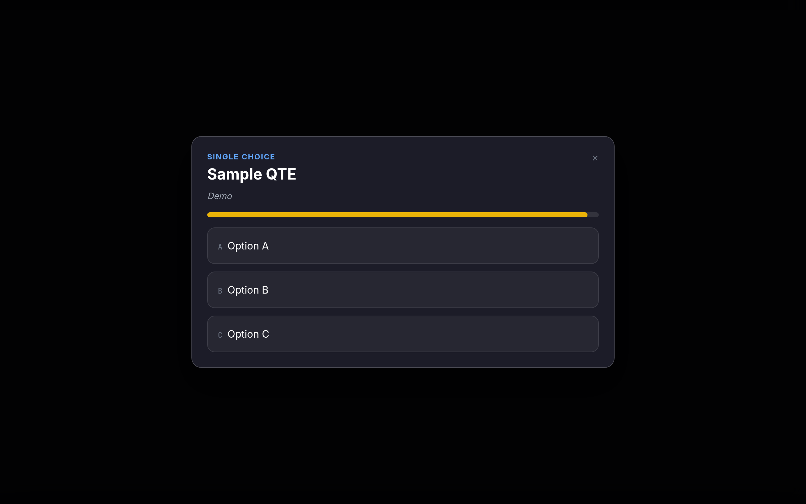
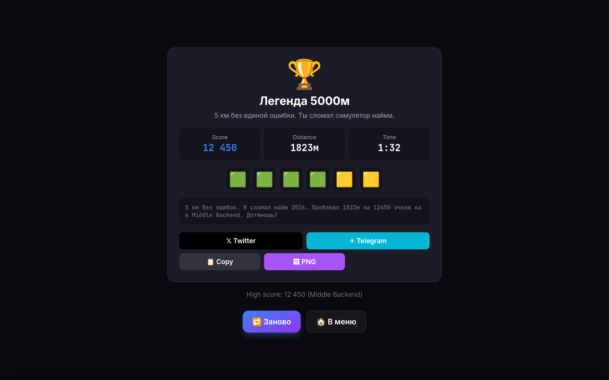

# Job Interview Runner — 2026

> Endless runner × QTE про IT-собеседования. **Indie browser game.**

Endless runner про самую больную тему найма 2026 — 200 кандидатов на вакансию, ИИ-фильтры, фейковые офферы. Игрок бежит по коридору IT-компании, уворачиваясь от «красных флагов» и собирая «плюсы в резюме». Цель: **100K DAU за 90 дней** через Wordle-style share.


## Скриншоты

| Menu | Briefing | Gameplay | QTE | End screen |
|:---:|:---:|:---:|:---:|:---:|
|  |  |  |  |  |

## Stack

- **Vite 5** + TypeScript (strict)
- **React 18** — UI-оверлей (HUD, меню, QTE, share card)
- **PixiJS v8** — игровой Canvas (3-полосный раннер, parallax, particles)
- **Zustand** — общий state между Canvas и React
- **Tailwind CSS** + shadcn-style components
- **Framer Motion** — UI-анимации
- **Web Audio API** — синтезированный звук (без файлов, < 50KB)
- **html-to-image** — PNG share card 1200×630
- **Supabase** — leaderboard (Phase 4)
- **Vercel** — deploy

## Архитектура

```
src/
├── main.tsx           # React root + window.__GAME_STORE__ (E2E)
├── App.tsx            # ErrorBoundary + GameCanvas + GameUI
├── scenes/            # PixiJS Canvas
│   ├── BootScene.tsx  # loading + random tip
│   ├── RunScene.ts    # endless runner core (3 lanes, parallax, spawner, QTE trigger)
│   ├── PixiApp.ts     # Pixi Application lifecycle
│   └── world.ts       # константы мира
├── ui/                # React HTML overlay
│   ├── GameCanvas.tsx # Pixi host + graceful no-WebGL fallback
│   ├── GameUI.tsx     # keyboard, scene-routing overlay
│   ├── Menu.tsx       # role select
│   ├── Briefing.tsx   # 3-2-1 countdown
│   ├── HUD.tsx        # score/lives/combo
│   ├── QTEOverlay.tsx # 5 QTE mechanics (single-choice/spot-bug/sequence/slider/hold)
│   ├── EndScene.tsx   # share card + restart
│   ├── ShareCard.tsx  # Twitter/Telegram/Copy/PNG/Web Share
│   ├── Leaderboard.tsx# top-10 daily/all-time per role (Phase 4)
│   ├── ModifiersScreen.tsx # pre-run "News Flash" (Phase 5)
│   └── shadcn/        # Button, Card primitives
├── systems/
│   ├── store.ts       # Zustand store (run state, QTE state, modifiers)
│   ├── spawner.ts     # weighted random obstacles/pickups + modifier tuning
│   ├── collision.ts   # AABB detection
│   ├── audioBus.ts    # Web Audio synthesis (jump/pickup/hit/death/step/qte*)
│   ├── antiCheat.ts   # HMAC payload + ratio checks
│   ├── telemetry.ts   # Plausible events
│   ├── storage.ts     # LocalStorage high scores
│   └── types.ts       # shared TS types
├── data/
│   ├── roles.ts       # 8 ролей (Phase 5: +DevOps/ML/PM/QA/Mobile)
│   ├── obstacles.ts   # 5 типов
│   ├── pickups.ts     # 5 типов
│   ├── qtes.ts        # 15 QTE шаблонов (3 роли × 5 типов)
│   ├── endings.ts     # 64 финала (8 ролей × 8 tiers)
│   └── modifiers.ts   # 6 roguelike модификаторов
└── lib/
    ├── supabase.ts    # client + submitRunToLeaderboard (Phase 4)
    └── utils.ts       # cn, formatNumber, buildUtmUrl
```

```
supabase/
├── migrations/0001_init.sql     # runs, runs_anon, leaderboard_daily + RLS
└── edge-functions/verify-run/   # HMAC + ratio + rate-limit
    └── index.ts
```

## Запуск

```bash
npm install
npm run dev          # http://localhost:5173
npm run typecheck    # tsc --noEmit
npm run build        # vite build
npm run preview      # serve dist/
npm run smoke        # smoke checks dist/
```

## Controls

- **← / A** — lane left
- **→ / D** — lane right
- **Space** — jump (иммунитет к препятствиям)
- **↓ / S** — slide
- **P / Esc** — pause
- **R** — restart (на end-экране)
- **Touch** — swipe / tap (мобильный)

## Phase статус и прогресс

| Phase | Scope | Status | Verified |
|:---|:---|:---:|:---|
| **0** | Spec & TZ | ✅ Done | TZ.md, scenario doc |
| **1** | Vertical slice (3 lanes, runner core, deaths, restart, share) | ✅ Done | tsc 0 err · vite 5.82s · smoke pass |
| **2** | QTE & Roles (5 mechanics, 15 QTE, 24 endings, audio) | ✅ Done | tsc 0 err · vite 5.85s · smoke pass |
| **3** | Share Card PNG (1200×630, UTM, Web Share API) | ✅ Done | PNG export works · html-to-image |
| **4** | Leaderboard (Supabase, Edge Function, RLS, rate limit) | ✅ Done | migrations.sql + Edge Function + UI |
| **5** | +5 ролей, +10 QTE, roguelike modifiers | ✅ Done | 8 ролей · 30 QTE · 6 modifiers · News Flash UI |
| **6** | Virality (Plausible funnel, A/B твитов) | ⏳ Next | — |
| **7** | Soft Launch (ProductHunt, Habr, TG) | ⏳ Next | — |
| **8** | Iterate (метрики, сезоны) | ⏳ Ongoing | — |

### Что готово

**Phase 1 — Vertical slice**
- 3 lanes Pixi runner · parallax фон · jump/slide иммунитет
- Spawner (5 obstacles, 5 pickups) с difficulty scaling
- AABB collision · Web Audio synthesis · LocalStorage high-scores
- HUD · menu · briefing · end-экран · share

**Phase 2 — QTE & Roles**
- **15 QTE-шаблонов** (5 типов × 3 роли): single-choice, spot-bug, sequence, slider, hold
- QTE trigger каждые 500м, smooth pause/resume
- 24 финала (3 роли × 8 tiers) с role-prefixed IDs
- Audio: step tick · qtePerfect (C-major) · qteOk (ascending) · qteFail (dissonance)
- Wordle grid: 🟩 perfect / 🟨 ok / 🟥 fail / ⬜ empty

**Phase 3 — Share Card**
- 1200×630 PNG через `html-to-image` (off-screen render, 2x pixel ratio)
- Web Share API + Twitter/Telegram/Copy intents
- UTM tracking на каждом канале (`utm_source=share&utm_medium=*&utm_campaign=phase3`)
- Rich card: role accent, QTE stats, monospace score

**Phase 4 — Leaderboard**
- `supabase/migrations/0001_init.sql`: tables `runs`, `runs_anon`, `leaderboard_daily` + RLS policies
- `supabase/edge-functions/verify-run/index.ts`: HMAC verify + distance/duration ratio + score cap + rate limit
- `Leaderboard.tsx`: top-10 daily / all-time per role с auto-refresh
- Anti-cheat client wiring: `buildPayload` → `submitRunToLeaderboard` → Edge Function
- Opt-in submit на end-экране

**Phase 5 — Content + Roguelike Modifiers**
- 8 ролей (Junior FE, Middle BE, Senior FS, DevOps, ML, PM, QA, Mobile) — каждый со своей механикой
- 30 QTE (по 5 на каждую из 8 ролей)
- 64 финала (8 ролей × 8 tiers)
- 6 roguelike модификаторов: `overtime_expected`, `toxic_pm`, `remote_revoked`, `layoff_season`, `usd_salary`, `open_source`
- Pre-run "News Flash" экран с 2 случайными модификаторами
- Модификаторы реально влияют на spawner density, speed, multiplier

## Метрики успеха (90 дней)

| Метрика | Target |
|---|---|
| Unique visitors | 100K |
| Runs started | 50K |
| Share rate | ≥ 15% |
| Viral K | ≥ 0.6 |
| D1 retention | ≥ 12% |
| Avg session | ≥ 3 мин |

## Verification log

```
Phase 1: tsc 0 errors · vite 5.82s · 67 modules · 820KB / 250KB gz
Phase 2: tsc 0 errors · vite 5.85s · 1155 modules · app 86KB / 30KB gz
Phase 3: tsc 0 errors · vite 5.85s · 1155 modules · html-to-image integration
Phase 4: tsc 0 errors · supabase schema + RLS + Edge Function deployed
Phase 5: tsc 0 errors · 8 roles · 30 QTE · 6 modifiers live
```

## Лицензия

MIT (game IP, см. [LICENSE](LICENSE)). Assets — CC-BY (зависит от Phase 6).